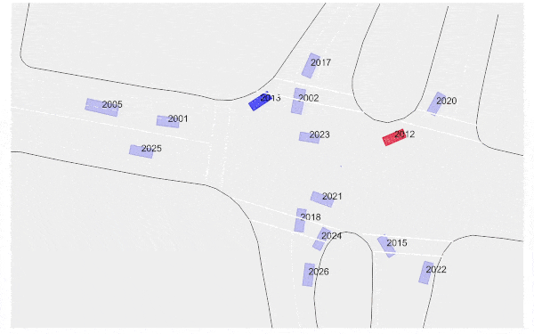
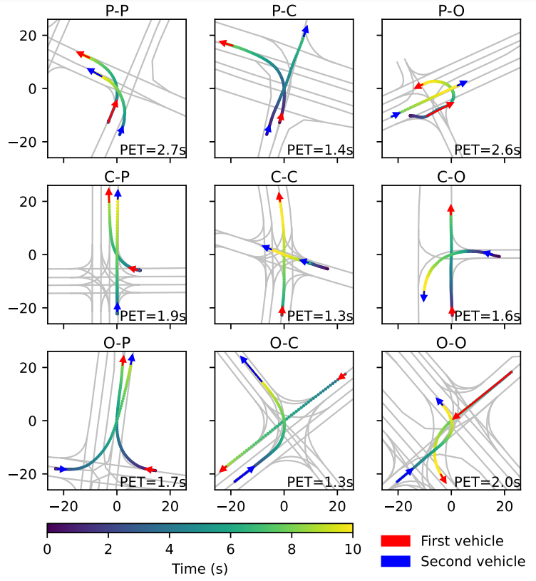

<ul class="nav project-nav col-12 col-lg-auto me-lg-auto mb-2">
  <li><a href="#two-dimensional-spacing" class="nav-link px-2">Two-Dimensional Spacing</a></li>
  <li><a href="#cooperative-interaction" class="nav-link px-2">Cooperative Vehicle Interaction</a></li>
  <li><a href="#datasets" class="nav-link px-2">Datasets</a></li>
  <li><a href="#contact" class="nav-link px-2">Contact</a></li>
</ul>

## Inferring vehicle spacing in urban traffic from trajectory data
{: #two-dimensional-spacing}

  

    

      
    

    

      🤔 Quantifying space and time use of drivers is a foundation of traffic research. It is straightforward to measure space use of vehicles when they are following each other, as 1D spacing. But if thinking about vehicles interacting with each other two-dimensionally, such as at urban intersections, how do we measure the 2D spacing between them?
    

      
    

      📐 In the first study of my PhD research, we developed a method to infer 2D vehicle spacing in urban traffic from trajectory data. This method offers a new approach to quantifying and thus evaluating the average amount of necessary road space for vehicle interaction. Python code of the method and instructions on repeating the experiments are open-sourced on GitHub.
    

    
    

    💡 As a particularly interesting finding, our measurement of 2D spacing results in a relation that is visually and conceptually similar to the Fundamental Diagrams in car-following traffic theory. We term it iFD (interaction Fundamental Diagram) as it reflects the relationship between interaction density and interaction rate at varying relative speeds of vehicles.
    

  

  

    

      
      <b>Real-world examples of vehicle interactions in urban environments.</b> 𝜔 is the angle between moving directions of the interacting vehicles. (a) Vehicle interactions only in the longitudinal direction. (b) Vehicle interactions involving both longitudinal and lateral directions.
    

    

    

      
      <b>Proposed framework to infer average 2D vehicle spacing from trajectory data.</b> (a) Coordinate transformation of vehicle pairs in the figure above. (b) Accumulated data samples of transformed vehicle pairs. (c) Data samples that are conditioned by relative speeds, where the hollows are driver space. (d) Spacing inference from the conditioned data samples.
    

    

      <a href="https://doi.org/10.1016/j.trc.2023.104289">Paper Link</a> |  <a href="https://github.com/Yiru-Jiao/DriverSpaceInference">GitHub Repository</a>
    

  

---

## Cooperative vehicle interaction at urban intersections
{: #cooperative-interaction}

Interactions between vehicles are extensive at intersections and significantly influence traffic efficiency and safety. In the domain of traffic safety, vehicle interactions refer to situations where two or more road users approach each other and are precursor of accidents. Such sole focus on conflicts and potential collisions overlooks cooperative interaction. For eaxmple, drivers may actively wait for others to pass first.

With Proximity Resistance (PR), which measures two-dimensional spacing between vehicles, we can identify interacting vehicles when their spacing is smaller than typically considered desirable by the drivers. This identification covers cooperative vehicle interactions beyond conflicts. We hope this study contributes towards a more comprehensive understanding of vehicle interaction at urban intersections.

  

    <h5 style="text-align: center">Example One</h5>
    
  

  

    <h5 style="text-align: center">Example Two</h5>
    
  

  

    <h5 style="text-align: center">Example Three</h5>
    
  

  

    <h5 style="text-align: center">Example Four</h5>
    
  

  

    <h5 style="text-align: center">Example Five</h5>
    
  

  

    <h5 style="text-align: center">Example Six</h5>
    
  

---

## Datasets for studying driving reaction difference between human-driven vehicles (HVs) and autonomous vehicles (AVs)
{: #datasets}

Do human drivers behave differently when they interact with automated vehicles in urban traffic, and if so, how?

Increasing attention is drawn to this question as autonomous driving is entering our real lives. While automated vehicles hold (perhaps too much) promise for reducing congestion, lowering CO2 emissions, and improving transport efficiency, we currently know quite little about their influence on the traffic system. Such influence does not depend solely on how automated vehicles drive, but also (if not more) on how human drivers react to them.

To answer this question requires high-quality and high-fidelity data. Thanks to the release of sensor data by companies such as Lyft and Argoverse, we can extract trajectories of interactions between human-driven vehicles (HV) and automated vehicles (AV)! We open-sourced two trajectory datasets (with maps) to facilitate research in HV-AV interaction in urban traffic.

  

    <h5>Urban car-following in Palo Alto, Carlifornia</h5>
      

        This dataset focuses on car-following behaviour and is extracted from Lyft open data. We obtained 29k+ HV-following-AV pairs and 42k+ HV-following-HV pairs of trajectories, with a total driving distance of 150k+ km. These trajectories cover all of the car-following regimes, and each pair lasts for at least 15 seconds.
      

      
      

        <a href="https://github.com/RomainLITUD/Car-Following-Dataset-HV-vs-AV" style="text-align: left;">Available on GitHub</a>
      

      

        
        <b>Figure: Trajectory denoising example</b>
      

      

      

        
        <b>Figure: Car-following regime diversity in the dataset</b>
      

  

  

    <h5>Conflict resolving at intersections in 6 U.S. cities</h5>
    

      This focuses on conflict resolution at urban intersections and is extracted from Argoverse open data. We have 5k+ AV-involved and 16k+ AV-free scenarios where two vehicles coordinate with each other to pass the same conflict area. Detailed information for each conflict resolution process, including map, other road users, post-encroachment-time, moving directions before and after conflict, and the conflict category are also offered.
    

    

      <a href="https://github.com/RomainLITUD/conflict_resolution_dataset" style="text-align: left;">Available on GitHub</a>
    

    

      
      <b>Conflict-resolving regime examples</b>
    

  

 

## Contact
{: #contact}

  

    

        
    

    

      

        <h5 class="card-title"><a href="https://www.tudelft.nl/en/ceg/about-faculty/departments/transport-planning/staff/personal-pages/y-yiru-jiao">Yiru Jiao</a></h5>
        

          PhD Candidate 
          <a href="mailto:Y.Jiao-1@tudelft.nl">Y.Jiao-1@tudelft.nl</a> 
          
        

      

    

  

