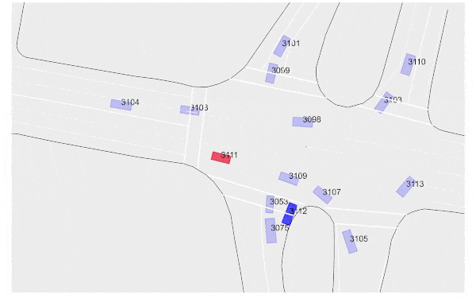
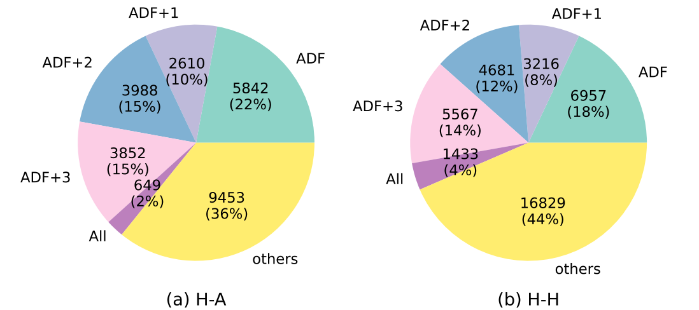

<ul class="nav project-nav col-12 col-lg-auto me-lg-auto mb-2">
  <li><a href="#two-dimensional-spacing" class="nav-link px-2">2D Spacing Inference</a></li>
  <li><a href="#cooperative-interaction" class="nav-link px-2">Cooperative Vehicle Interaction</a></li>
  <li><a href="#av-hv-car-following" class="nav-link px-2">Reduced Headway after AVs</a></li>
  <li><a href="#conflict-detection" class="nav-link px-2">Traffic Conflict Detection</a></li>
  <li><a href="#datasets" class="nav-link px-2">Datasets/Softwares</a></li>
  <li><a href="#contact" class="nav-link px-2">Contact</a></li>
</ul>

---

## Inferring vehicle spacing in urban traffic from trajectory data
{: #two-dimensional-spacing}

  

    

      
    

    

      🤔 Quantifying space and time use of drivers is a foundation of traffic research. It is straightforward to measure space use of vehicles when they are following each other, as 1D spacing. But if thinking about vehicles interacting with each other two-dimensionally, such as at urban intersections, how do we measure the 2D spacing between them?
    

      
    

      📐 In the first study of my PhD research, we developed a method to infer 2D vehicle spacing in urban traffic from trajectory data. This method offers a new approach to quantifying and thus evaluating the average amount of necessary road space for vehicle interaction. Python code of the method and instructions on repeating the experiments are open-sourced on GitHub.
    

    
    

    💡 As a particularly interesting finding, our measurement of 2D spacing results in a relation that is visually and conceptually similar to the Fundamental Diagrams in car-following traffic theory. We term it iFD (interaction Fundamental Diagram) as it reflects the relationship between interaction density and interaction rate at varying relative speeds of vehicles.
    

  

  

    

      
      <b>Real-world examples of vehicle interactions in urban environments.</b> 𝜔 is the angle between moving directions of the interacting vehicles. (a) Vehicle interactions only in the longitudinal direction. (b) Vehicle interactions involving both longitudinal and lateral directions.
    

    

    

      
      <b>Proposed framework to infer average 2D vehicle spacing from trajectory data.</b> (a) Coordinate transformation of vehicle pairs in the figure above. (b) Accumulated data samples of transformed vehicle pairs. (c) Data samples that are conditioned by relative speeds, where the hollows are driver space. (d) Spacing inference from the conditioned data samples.
    

    

      <a href="https://doi.org/10.1016/j.trc.2023.104289">Paper Link</a> |  <a href="https://github.com/Yiru-Jiao/DriverSpaceInference">GitHub Repository</a>
    

  

---

## Cooperative vehicle interaction at urban intersections
{: #cooperative-interaction}

Interactions between vehicles are extensive at intersections and significantly influence traffic efficiency and safety. In the domain of traffic safety, vehicle interactions refer to situations where two or more road users approach each other and are precursor of accidents. Such sole focus on conflicts and potential collisions overlooks cooperative interaction. For eaxmple, drivers may actively wait for others to pass first.

With Proximity Resistance (PR), which measures two-dimensional spacing between vehicles, we can identify interacting vehicles when their spacing is smaller than typically considered desirable by the drivers. This identification covers cooperative vehicle interactions beyond conflicts. We hope this study contributes towards a more comprehensive understanding of vehicle interaction at urban intersections.

  

    <h5 style="text-align: center">Example One</h5>
    
  

  

    <h5 style="text-align: center">Example Two</h5>
    
  

  

    <h5 style="text-align: center">Example Three</h5>
    
  

  

    <h5 style="text-align: center">Example Four</h5>
    
  

  

    <h5 style="text-align: center">Example Five</h5>
    
  

  

    <h5 style="text-align: center">Example Six</h5>
    
  

---
## Beyond Behaviour Change: Investigating Alternative Explanations for Shorter Time Headways When Human Drivers Follow Automated Vehicles
{: #av-hv-car-following}

  

    

      How do human drivers react when they follow behind automated vehicles?
    

      
    

      
    

    

      🤔 Many empirical studies observed shorter time headway of human drivers following automated vehicles (AVs) compared to following human driving vehicles (HVs). This sounds exciting -- not only can AVs maintain shorter time headway from leading vehicles, but also human drivers behind AVs -- such a good sign for traffic improvement! 
    

    
    

      
    

    

       😈 However, this is far from the whole story. AV-involved data are mostly collected by AVs naturalistically (without experimental design or control). In this case, inconsistent conditions inherent in the HV-following-AV and HV-following-HV scenarios make an effective comparison more complicated than one would expect.
    

    

    

      
      <b>Car-following states during data collection:</b> time headway varies across different car-following states. Non-steady states generally have larger time headways, reducing overall average time headway. Focusing on steady-state following, the average time headway reduction shrinks from 0.61s to 0.33s. 
    

  

  

    

      
      <b>Driving variability of leading vehicles:</b> homogeneity in leading vehicles' driving styles narrows time headway variance, shortening averages. Following a single HV reduces average time headway by 0.17s compared to following heterogeneous HVs. This suggests human drivers' time headway reduction behind AVs is influenced by uniform AV driving algorithms.
    

    

    

      
      <b>Unique driving characteristics of AVs:</b> AVs’ specific driving significantly impacts reduced time headways. Human drivers following AVs with stable driving characteristics have around 0.10s shorter time headway than when following AVs mimicking HVs. Supporting evidence: No headway reduction observed when humans followed a “Wizard of Oz” AV (operated by a human but perceived as an AV), compared to an HV.
    

    

      <a href="https://doi.org/10.1016/j.trc.2024.104673">Paper Link</a> |  <a href="https://github.com/Yiru-Jiao/Explaining-headway-reduction-of-HVs-following-AVs">GitHub Repository</a>
    

  

---
## Traffic conflict detection
{: #conflict-detection}

Conflict is

  

    <h5>How do we determine thresholds for collision warning?</h5>

    

      With labelled data, this question is not complicated. As a binary classification between "yes there is a potential collision" and "no there is no potential collision", the threshold is a parameter to optimise an objective, which can vary but generally minimises missed and false alarms.
    

    

      However, unsafe and safe driving are highly imbalanced in daily basis. One may encounter only one conflict per tens-of-km driving. This makes it difficult to collect labelled data. Without labelled conflicts, how do we still optimise thresholds? The key is estimation. As shown in the picture, the new method we propose can minimise false alarms and missed alarms for both synthetic and real-world conflicts, which account for less than 0.1%, without knowing their labels.
    

      
    

      
    

    

      The minimisation is as good as it gets, depending on how much effective information of the conflict context is properly considered. We think this constrains the trade-off (ROC curve) between false alarms and missed alarms of a detection model.
    

    

      <a href="https://doi.org/10.1109/IV55156.2024.10588396">Paper Link</a> |  <a href="https://github.com/Yiru-Jiao/Conflict-detection-MFaM">GitHub Repository</a>
    

  

  

    <h5>A unified theory and statistical learning approach to conflict detection</h5>

    

       How do we evaluate the safety level of an interaction? There are a variety of Surrogate Measures of Safety (SMoS) for various interaction scenarios such as car-following, lane-changing, crossing, etc.; for each of them, the threshold distinguishing safe and unsafe interactions also varies in different traffic conditions.  This variety of SMoS makes safety evaluation inconsistent and difficult to compare across different scenarios. As the rapid development of autonomous vehicles (AVs) and connected vehicles (CVs) is reshaping the traffic environment, it is crucial to have a unified theory and method to evaluate the safety level of interactions.
    

      
    

      
    

    

      Conflicts do not appear from nowhere, and every conflict is an extreme event continued from safe driving. We consider conflicts as context-dependent extreme events in ordinary interactions; statistical learning enables data-driven hypotheses of conflicts incorporating diverse factors. This methodology performs at least as well as existing SMoS, both theoretically and experimentally; it is also generalizable across different traffic environments. Consistent evaluations can support scalable and reliable safety research in the future, especially in the age of autonomous driving.
    

    

      <a href="https://arxiv.org/abs/2407.10959">Paper Link</a> |  <a href="https://github.com/Yiru-Jiao/UnifiedConflictDetection">GitHub Repository</a>
    

  

---
## Datasets/Softwares
{: #datasets}

### Reconstructed bird's eye view trajectories of the crashes and near-crashes from the 100-Car NDS data

Around 2000, a large-scale naturalistic driving study was conducted in the US. More than 100 passenger cars were equipped with sensors and their drivers were asked to drive as usual for two years, with minimal intervention by the research team. During the project, 68 crashes plus 760 near-crashes were recorded with pre- and post-event radar and accelerometer data compiled, along with natural language descriptions of the events. This is the 100-Car NDS data that has been widely used in traffic safety studies.

In 2018, non-sensitive data in the project were released under the license of CC0 1.0., including the time-series data and linguistic description data mentioned above. Coincidentally, highD was also released in 2018 as the first large-scale drone trajectory dataset, which has become the most widely used bird's eye view trajectory dataset after NGSIM. 

Various methods, especially those utilise machine learning, have been developed based on bird's eye view data as input. However, when it comes to validation, many of them used synthetic conflicts defined by TTC or generated with traffic simulations. This lack of real-world validation is the major motivation to make the reconstruction (But this effort is still far from even enough).

  <a href="https://github.com/Yiru-Jiao/Reconstruct100CarNDSData?tab=readme-ov-file" style="text-align: left;">Available on GitHub</a>

  

    

      
    

  

  

   

      Not all of the events can be reconstructed due to the missing values, inaccuracy of sensing, and the lack of a ground truth. The following example visualises one of the reconstructed and matched crashes.
    

    

      
    

  

### Datasets for studying driving reaction difference between human-driven vehicles (HVs) and autonomous vehicles (AVs)

Do human drivers behave differently when they interact with automated vehicles in urban traffic, and if so, how?

Increasing attention is drawn to this question as autonomous driving is entering our real lives. While automated vehicles hold (perhaps too much) promise for reducing congestion, lowering CO2 emissions, and improving transport efficiency, we currently know quite little about their influence on the traffic system. Such influence does not depend solely on how automated vehicles drive, but also (if not more) on how human drivers react to them.

To answer this question requires high-quality and high-fidelity data. Thanks to the release of sensor data by companies such as Lyft and Argoverse, we can extract trajectories of interactions between human-driven vehicles (HV) and automated vehicles (AV)! We open-sourced two trajectory datasets (with maps) to facilitate research in HV-AV interaction in urban traffic.

  

    <h5>Urban car-following in Palo Alto, Carlifornia</h5>
      

        This dataset focuses on car-following behaviour and is extracted from Lyft open data. We obtained 29k+ HV-following-AV pairs and 42k+ HV-following-HV pairs of trajectories, with a total driving distance of 150k+ km. These trajectories cover all of the car-following regimes, and each pair lasts for at least 15 seconds.
      

      
      

        <a href="https://github.com/RomainLITUD/Car-Following-Dataset-HV-vs-AV" style="text-align: left;">Available on GitHub</a>
      

      

        
        <b>Figure: Trajectory denoising example</b>
      

      

      

        
        <b>Figure: Car-following regime diversity in the dataset</b>
      

  

  

    <h5>Conflict resolving at intersections in 6 U.S. cities</h5>
    

      This focuses on conflict resolution at urban intersections and is extracted from Argoverse open data. We have 5k+ AV-involved and 16k+ AV-free scenarios where two vehicles coordinate with each other to pass the same conflict area. Detailed information for each conflict resolution process, including map, other road users, post-encroachment-time, moving directions before and after conflict, and the conflict category are also offered.
    

    

      <a href="https://github.com/RomainLITUD/conflict_resolution_dataset" style="text-align: left;">Available on GitHub</a>
    

    

      
      <b>Conflict-resolving regime examples</b>
    

  

 

## Contact
{: #contact}

  

    

      
    

    

      

        <h5 class="card-title"><a href="https://www.tudelft.nl/en/ceg/about-faculty/departments/transport-planning/staff/personal-pages/y-yiru-jiao">Yiru Jiao</a></h5>
        

          PhD Candidate 
          <a href="mailto:Y.Jiao-1@tudelft.nl">Y.Jiao-1@tudelft.nl</a> 
          
        

      

    

  

